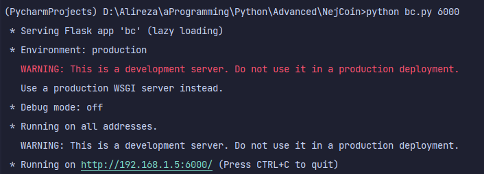
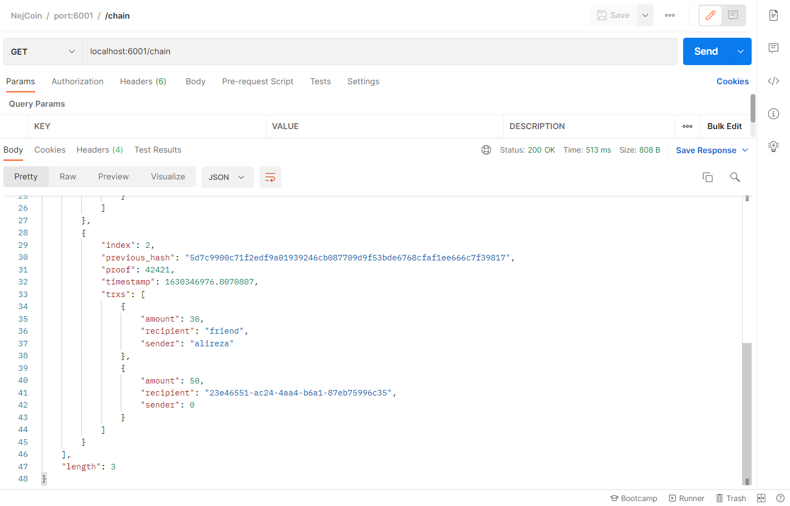
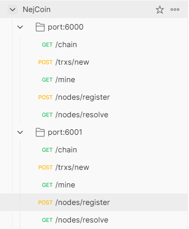

# **NejCoin**

#### sample blockchain made in python based on Bitcoin studies

#### `Developer: Alireza Nejadipour`

for running the program, go to the program's directory and write this in your terminal:

`python bc.py <port>`

u will see something like this:

I have added a .postman [file](NejCoin.postman) for you to test the program

just import it and try different requests

the requests ports are "6000" and "6001"

